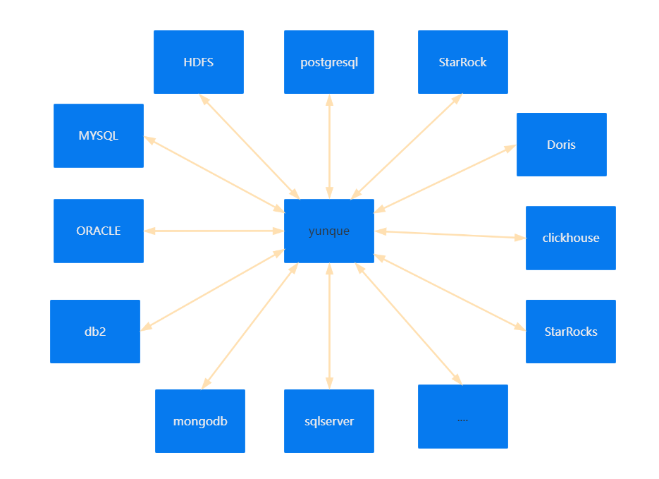
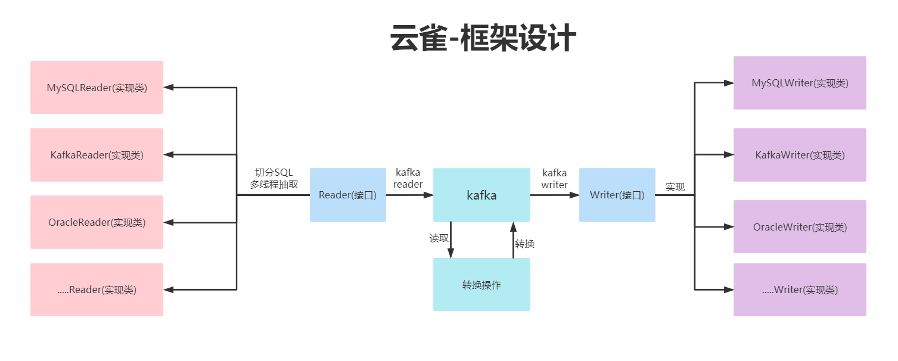

[](README.en.md)
[](README.md)


# 1.云雀的介绍

 **云雀**，云代表大数据，雀代表平凡和自由。


**云雀** 是一款数据集成工具，实现异构数据源的整合，帮助企业构建数据仓库、数据湖 等应用架构。


# 2.云雀的架构图




# 3.云雀的流程图




# 4.源码编译

## 4.1获取代码

```
git clone https://gitee.com/LarkMidTable/yunque.git
```

## 4.2 编译

```
mvn clean package -DskipTests
```

# 5.快速开始


sh start.sh


# 6.云雀的规划及优点：

1.云雀目前支持数据源达到14种，能够实现异构数据源的同步。


2.云雀支持拖拉拽的图形化的操作，用户可以通过页面的组装输入和输出组件，实现页面化简易操作。


3.云雀结合计算引擎，实现异构数据源数据统一汇聚，数据湖，数据仓库，实现数据的集成。


4.云雀结合消息队列，实现一份数据一次读取，多次下沉多种数据库和重复利用，支持海量数据，高速率的迁移数据。


5.云雀支持单机版和集群版部署，架构简易。


6.云雀打印日志友好，能实时监控迁移的数据量，迁移的状态，以及报错日志详细，便于排查。


7.云雀代码清晰，可读性强，代码之美，文档详细，资料齐全。


8.云雀支持Docker和K8S集群容器化部署。


9.云雀易于集成，能无缝对接开源的调度系统，以及集成系统，配置多样化。


10.云雀遵从Apache协议，可以进行商业化部署。


# 7.开发人员

**开发人员 ：**【 排名不计先后】

 [ZFCode](https://gitee.com/ZFCode)  、[陈小明](https://gitee.com/cenzhiming) 、[zhaowendong](https://gitee.com/PK_zwd) 、[baiyaoming](https://gitee.com/baiyaoming) 、[甲壳虫123](https://gitee.com/njhuanghua) 、[wangzyunquei](https://gitee.com/wangzyunquei1204) 、[youki](https://gitee.com/coreland_eip) 、[Forever](https://gitee.com/GenBrother) 、[Singularity](https://gitee.com/dangzefei) 、[红叶](https://gitee.com/houstao) 、 [起风了](https://gitee.com/its_windy) 、[qtyb](https://gitee.com/qtyb) 、[lindychan556666](https://gitee.com/chenlin556666) 


# 8.联系我们

可以添加官方微信【**LarkMidTable2021**】,添加时备注【yunque】，可以参与讨论啦！


本项目全部开源，可以进行商用没有限制，我们热切的盼望，希望有更多的开发者加入，开源数据集成的这个大家庭中，欢迎大家贡献和使用。


# 9.感谢人员

感谢云雀课堂的学员的支持，项目才得以进行下去，以下为第一期的**云雀课堂学员**，名次部分先后：


成空、起风了、孙~龙、王~田、如是、瞬间永恒、钟~俊


周~城、小田甜、重庆张~友、葡萄、景曦、江阔、徐祥静


Us、猪皮、曾攀、溪涣、A.wang、青鸟、朱古力、wingod


khj、吴志航、黄华、君临、qiuqiuqiu、Jerry、圈圈圈


明昌、Mr杨、Sokach、Forever、ShakeSpeare、东哥


Tony_cen、小小若木、无说有听、dearong、修真、sockstack


Cole、轮子、彪哥、倪~喜、冯~孝、Aphasia、Yezhiwei、农民


navy、object、JSZ、全儿、恒古指针、~漫、MikeChen、冲浪仔


iDrive、abc、火箭、云风叶、payne、黄~峰、余~忠、就这~


黎英杰、养乐多、heaven、不许敲自己、明朗、Ya!、小白龙


摸金校尉、Chandler、光、需要努力的Jade🎭、youke、xx


