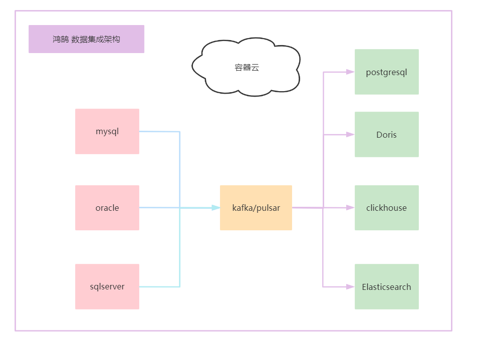

# 1.鸿鹄的介绍

**鸿鹄** 是云雀数据中台内部的 数据集成 工具，在多种应用场景和集成场景得以应用，专注于对异构数据源进行迁移入库，构建底层数仓并进行分析。

**鸿鹄** 出自《陈涉世家》，作者西汉司马迁。原文如下：

陈胜者，阳城人也，字涉。吴广者，阳夏人也，字叔。陈涉少时，尝与人佣耕，辍耕之垄上，怅恨久之，曰：“苟富贵，无相忘。”佣者笑而应曰：“若为佣耕，何富贵也？”陈涉太息曰：“嗟乎！燕雀安知鸿鹄之志哉！”

[官方网站](www.larkmidtable.com)

# 2.鸿鹄V1.0的架构

# 3.为什么做数据集成?

春江水暖鸭先知，我应该比较靠近市场的，那我渐渐就能感觉到数据集成的重要性，很多公司，很多公司都需要集成这样的工具。本身我们是做数据中台，所以想开源出一款比较受欢迎的开源工具，

比如能够集成Doris，Kafka，Iceberg，Pulsar ，这种常用的存储和流应用

# 4.数据集成工具目前痛点？

必须承认现有的数据集成工具非常的优秀【免得被别人打脸】

1.数据迁移过程中网络抖动，造成数据丢失

2.数据迁移过程中断电，如何进行断电续传

3.数据迁移的日志不够详细，数据迁移到那里了？

4.数据迁移过程中调优和优化，以及资源评估

5.数据迁移过程中拓展功能的拓展问题

6.数据迁移如果是大数据场景，非大数据场景，多种技术栈的选择

......

# 5.鸿鹄的定位是什么？

实战，注重实战...以解决问题为导向，以解决问题为价值取向，所以我们不是做开源最强，而是做实用的工具。

# 6.开发人员

目前拥有4名开发人员：  飞  、东子、Tony、驼铃声 

我们热切的盼望，有更多的开发者加入，开源数据集成的这个大家庭中，欢迎大家贡献和使用。

