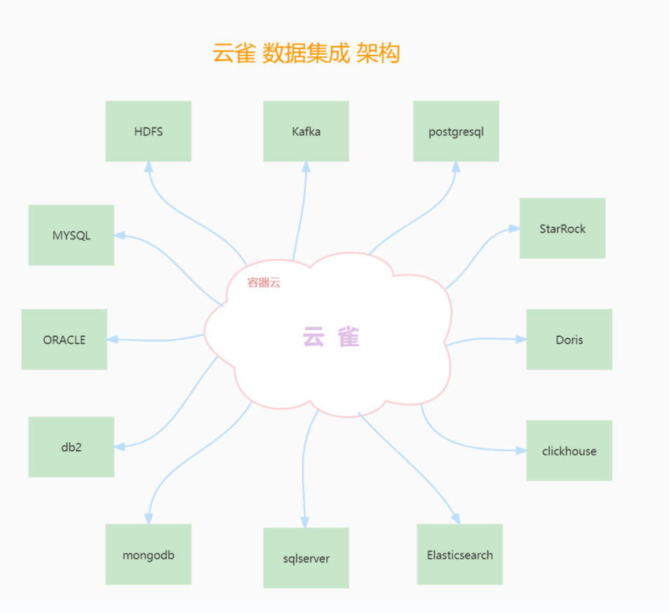

[](README.en.md)
[](README.md)


# 1.鸿鹄的介绍

**鸿鹄** 是云雀数据中台内部的 数据集成 工具，在多种应用场景和集成场景得以应用，专注于对异构数据源进行迁移入库，构建底层数仓并进行分析。


**鸿鹄** 出自《陈涉世家》，作者西汉司马迁。原文如下：

陈胜者，阳城人也，字涉。吴广者，阳夏人也，字叔。陈涉少时，尝与人佣耕，辍耕之垄上，怅恨久之，曰：“苟富贵，无相忘。”佣者笑而应曰：“若为佣耕，何富贵也？”陈涉太息曰：“嗟乎！燕雀安知鸿鹄之志哉！”


[官方网站](www.larkmidtable.com)


# 2.鸿鹄V1.0的架构




# 3.源码编译

## 3.1获取代码

```
git clone https://gitee.com/LarkMidTable/honghu.git
```

## 3.2 编译

```
mvn clean package -DskipTests
```

# 4.快速开始


sh start.sh


# 5.开发人员

**开发人员 ：**【 排名不计先后】

 [ZFCode](https://gitee.com/ZFCode)  、[陈小明](https://gitee.com/cenzhiming) 、[zhaowendong](https://gitee.com/PK_zwd) 、[baiyaoming](https://gitee.com/baiyaoming) 、[甲壳虫123](https://gitee.com/njhuanghua) 、[wangzhonghui](https://gitee.com/wangzhonghui1204) 、[youki](https://gitee.com/coreland_eip) 、[Forever](https://gitee.com/GenBrother) 、[Singularity](https://gitee.com/dangzefei) 、[红叶](https://gitee.com/houstao) 、 [起风了](https://gitee.com/its_windy) 、[qtyb](https://gitee.com/qtyb) 、[lindychan556666](https://gitee.com/chenlin556666) 


我们热切的盼望，有更多的开发者加入，开源数据集成的这个大家庭中，欢迎大家贡献和使用。

