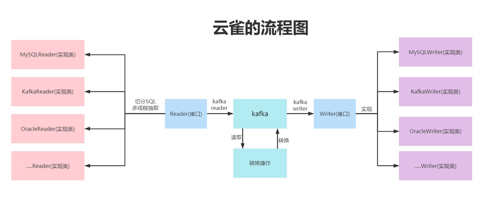

[](README.en.md)
[](README.md)


# 1.云雀的介绍

**云雀** 是云雀数据中台内部的 数据集成 工具，在多种应用场景和集成场景得以应用，专注于对异构数据源进行迁移入库，构建底层数仓并进行分析。


**云雀** 出自《陈涉世家》，作者西汉司马迁。原文如下：

陈胜者，阳城人也，字涉。吴广者，阳夏人也，字叔。陈涉少时，尝与人佣耕，辍耕之垄上，怅恨久之，曰：“苟富贵，无相忘。”佣者笑而应曰：“若为佣耕，何富贵也？”陈涉太息曰：“嗟乎！燕雀安知云雀之志哉！”


[官方网站](www.larkmidtable.com)


# 2.云雀的架构图


# 3.云雀的流程图




# 4.源码编译

## 4.1获取代码

```
git clone https://gitee.com/LarkMidTable/honghu.git
```

## 4.2 编译

```
mvn clean package -DskipTests
```

# 5.快速开始


sh start.sh


# 6.云雀的规划及优点：

1.云雀目前支持数据源达到14种，能够实现异构数据源的同步。


2.云雀支持拖拉拽的图形化的操作，用户可以通过页面的组装输入和输出组件，实现页面化简易操作。


3.云雀结合计算引擎，实现异构数据源数据统一汇聚，数据湖，数据仓库，实现数据的集成。


4.云雀结合消息队列，实现一份数据一次读取，多次下沉多种数据库和重复利用，支持海量数据，高速率的迁移数据。


5.云雀支持单机版和集群版部署，架构简易。


6.云雀打印日志友好，能实时监控迁移的数据量，迁移的状态，以及报错日志详细，便于排查。


7.云雀代码清晰，可读性强，代码之美，文档详细，资料齐全。


8.云雀支持Docker和K8S集群容器化部署。


9.云雀易于集成，能无缝对接开源的调度系统，以及集成系统，配置多样化。


10.云雀遵从Apache协议，可以进行商业化部署。


# 7.开发人员

**开发人员 ：**【 排名不计先后】

 [ZFCode](https://gitee.com/ZFCode)  、[陈小明](https://gitee.com/cenzhiming) 、[zhaowendong](https://gitee.com/PK_zwd) 、[baiyaoming](https://gitee.com/baiyaoming) 、[甲壳虫123](https://gitee.com/njhuanghua) 、[wangzhonghui](https://gitee.com/wangzhonghui1204) 、[youki](https://gitee.com/coreland_eip) 、[Forever](https://gitee.com/GenBrother) 、[Singularity](https://gitee.com/dangzefei) 、[红叶](https://gitee.com/houstao) 、 [起风了](https://gitee.com/its_windy) 、[qtyb](https://gitee.com/qtyb) 、[lindychan556666](https://gitee.com/chenlin556666) 


# 8.联系我们

可以添加官方微信【**LarkMidTable2021**】,添加时备注【yunque】，可以参与讨论啦！


本项目全部开源，可以进行商用没有限制，我们热切的盼望，希望有更多的开发者加入，开源数据集成的这个大家庭中，欢迎大家贡献和使用。

